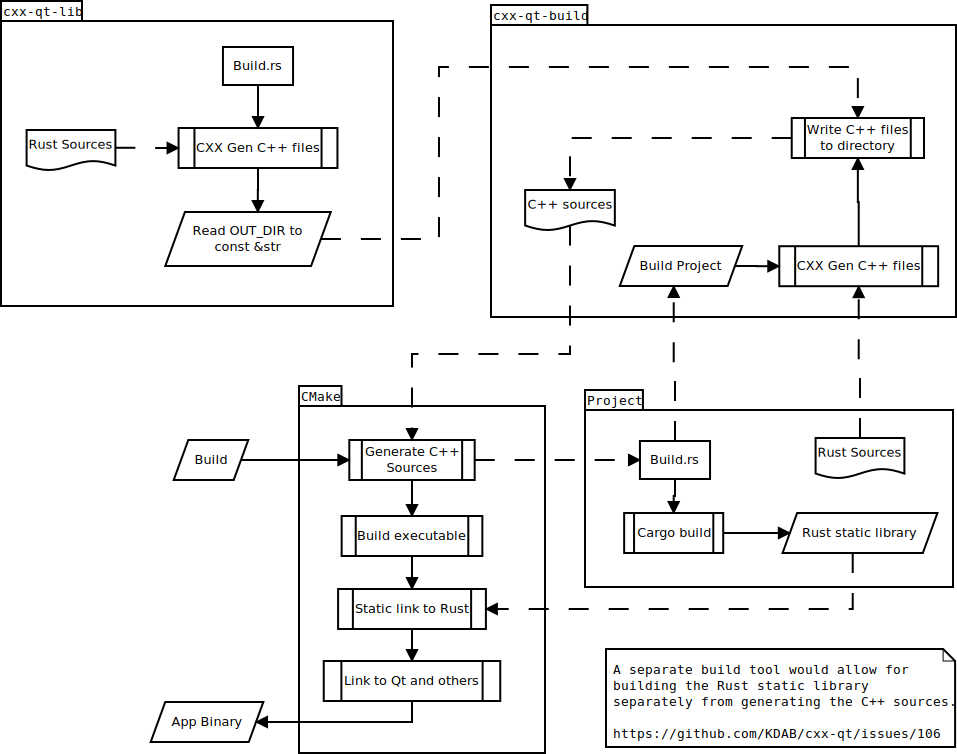

<!--
SPDX-FileCopyrightText: 2022 Klarälvdalens Datakonsult AB, a KDAB Group company <info@kdab.com>
SPDX-FileContributor: Andrew Hayzen <andrew.hayzen@kdab.com>

SPDX-License-Identifier: MIT OR Apache-2.0
-->

# 构建

在内部构建 CXX-Qt 项目的过程很复杂，包含多个阶段。

  1. CMake build 开始，并触发 cargo build
  2. CXX-Qt 构建生成 C++ 源码和静态库
  3. CMake 结合生成的源码构建项目 C++ 源
  4. CMake 将目标链接到 Rust 静态库和 Qt

## 1. Cargo 构建

当 cargo build 被触发时，这会导致依赖项被下载和构建。其中之一是 `cxx-qt-lib` 定义的 Qt 辅助类型。它包含一个 `build.rs`，其使用 CXX 生成 Qt 类型的 C++ 源代码。这会存储成一个在 crate OUT_DIR 目录下的 JSON 文件中。注意，我们无法从主项目中知道这些 `OUT_DIR` 文件或其他 `cxx-qt-lib` 文件在哪里，因为它们位于散列目录中。因此，`cxx-qt-lib` 在构建时，它使用 `include_str!` 将生成的 JSON 公开到 `QT_TYPES_CXX_JSON` 变量中。

下一步 cargo 触发 build.rs 主项目，它执行 `cxx-qt-build` 辅助方法。

## 2. CXX-Qt 构建

首先 `cxx-qt-build` 使用 CXX 为项目的 Rust 源文件生成 C++ 源文件到一个已知的位置 CMake (`target/cxx-qt-gen/`)。

然后 `cxx-qt-build` 将所有静态头文件（例如 CXX 头文件）和 `QQmlExtensionPlugin` 生成的代码写入同一个目录中。

接下来，它在 `cxx-qt-lib` 中使用字符串 `QT_TYPES_HEADER`、`QT_TYPES_SOURCE` 和 `QT_TYPES_CXX_JSON`（代表多个文件）将 C++ 源文件写入 CMake ( target/cxx-qt-lib/) 的已知位置 CMake (`target/cxx-qt-lib/`)中。

最后，它将生成的 C++ 源列表写入 `cxx-qt-gen` 文件夹中的 `cpp_sources.txt` 文件。

Cargo 现在继续正常构建 Rust 项目，扩展宏并创建静态库。

## 3. CMake 构建

现在 Rust 已经完成构建，CMake 读取生成的 C++ 源并将它们与项目 C++ 源融合（在此阶段还添加了 QML 资源）。

这会在 CMake 中生成一个可执行目标。

## 4. CMake 链接

现在我们有了一个可执行的目标，我们首先将目标从 cargo 链接到 Rust 静态库。然后我们链接任何外部库，例如线程库，最后链接到 Qt。

这将导致 CMake 生成一个二进制文件，该二进制文件将 Rust 与 C++ 应用程序结合在一起。

## 未来

将来，我们希望对 CMake 构建过程进行多项改进。

  * 将 CXX 生成和 Rust 构建拆分为单独的阶段。目前 CMake 的配置阶段会导致 Rust 构建。最好创建一个 CLI 工具，它只是为给定的 Rust 源生成 C++ 源并将它们写入给定的位置。然后这可以用于生成 C++ 源代码，并且可以在稍后的 CMake 构建阶段正常使用 cargo build [https://github.com/KDAB/cxx-qt/issues/106](https://github.com/KDAB/cxx-qt/issues/106)
     * CMake 如何知道要解析哪些 Rust 文件？如果我们可以将它指向一个清单并且它可以检测到 Rust 源文件，那将是最好的。
     * 该过程的哪个阶段将写入 `cxx-qt-lib` 文件？
  * 检测哪些库需要从依赖 crate 链接。例如，如果您的 Rust 插件使用带有 sqlite 实现的 diesel，您需要最终的 CMake 目标链接到[https://github.com/KDAB/cxx-qt/issues/29](https://github.com/KDAB/cxx-qt/issues/29)
  * 避免 C++ 中的命名包含冲突[https://github.com/KDAB/cxx-qt/issues/18](https://github.com/KDAB/cxx-qt/issues/19)
  * 考虑我们是否可以通过与 Cargo 工作空间一起使用的方式公开生成的源。目前多项目会与 `target/cxx-qt-*` 发生冲突。[https://github.com/KDAB/cxx-qt/pull/84](https://github.com/KDAB/cxx-qt/pull/84)

## 图表

下面是当前工作流程的抽象图

